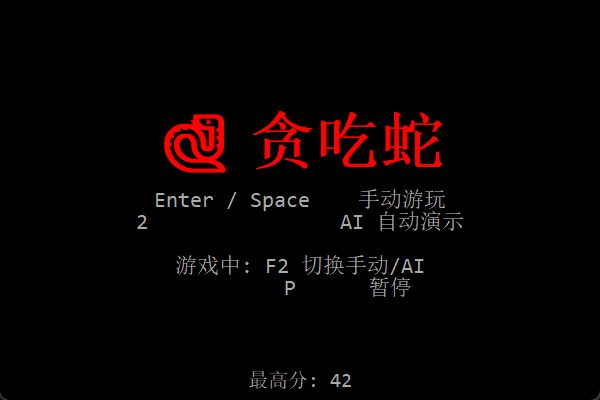
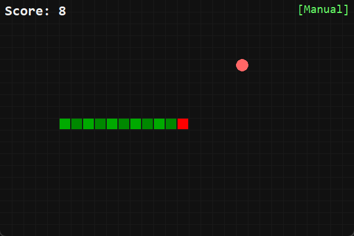
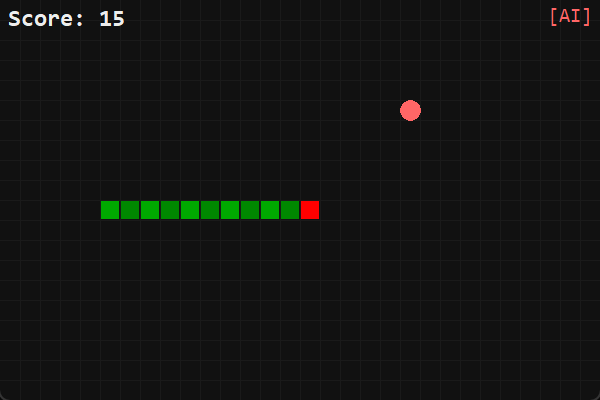
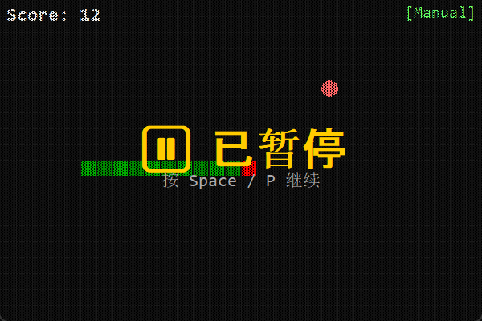
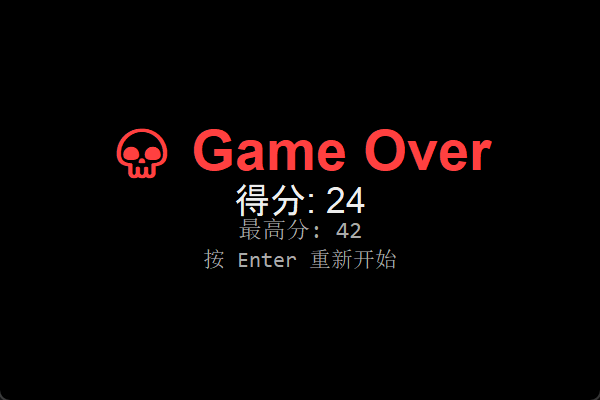

# 🐍 贪吃蛇 · AI智能对战版

一款能让你**躺着看AI自己玩**的经典贪吃蛇游戏！

---

## ✨ 特色

| 特性 | 说明 |
|------|------|
| 🎮 **双模式** | 手动操作 / AI自动演示，F2一键切换 |
| 🧠 **内置AI** | BFS路径规划 + 安全算法，分数轻松破百 |
| 🔴 **蛇头红色** | 一眼锁定，告别"我在哪" |
| ⚡ **速度递增** | 越玩越快，挑战性拉满 |
| 💾 **最高分保存** | 本地持久化，随时回来破纪录 |
| 📦 **即开即用** | 单文件 .exe，双击运行，无需安装 |

## 🎯 操作指南

| 按键 | 功能 |
|------|------|
| Enter / Space | 开始手动模式 |
| 数字键 `2` | 开启 AI 自动演示 |
| `F2` | 手动 / AI 切换 |
| `P` | 暂停 |
| ↑↓←→ / WASD | 控制方向 |

## 📸 截图

| 开始界面 | 手动模式 |
|:---:|:---:|
|  |  |

| AI 自动演示 | 暂停界面 | 游戏结束 |
|:---:|:---:|:---:|
|  |  |  |

## 📥 下载

👉 **[点此下载 贪吃蛇.exe](https://github.com/ttghub/snake-game/releases/latest)**  (~10.9 MB，双击即玩)

> 完全免费，纯用爱发电 ❤️ 喜欢的话给个 Star ⭐ 就行！

## 🛠️ 开发

```bash
# 运行游戏
python snake.py

# 运行 AI 跑分
python snake_ai.py

# 运行单元测试
python test_snake.py
```

纯 Python 标准库（tkinter + winsound），无需 pip 安装任何依赖。
